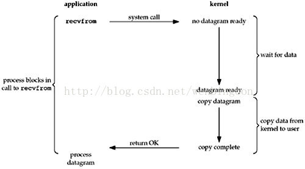
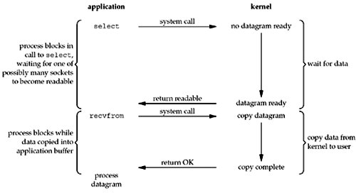

## 阻塞IO

传统的IO模型，在读与写的过程中发生阻塞现象

用户线程发出IO请求后，内核查看数据是否准备ok，没有ok就会等待阻塞，用户线程交出CPU，等待数据准备后，内核后将数据拷贝到用户线程，并返回结果给用户线程，用户线程解除blocking。

> recvfrom  ---systemcall---> nodata->--wait data ready -->data ready---->copydata----copy data from kernel to user>copy complete

应用面在调用recvfrom 的过程中，传入内核有两个过程，首先等待 data ready 之后copy 到用户态 这个过程中一直是阻塞的。

## 非阻塞IO

与阻塞IO相对应，非阻塞IO调用recvfrom后不需要一直等待而是马上就会得到一个结果，内核没有数据的时候会马上得到一个错误，一直等到内核中有数据，并且再次有recvfrom调用，就会将数据拷贝到用户空间，所以整个过程中，线程不会交出CPU资源的。

## I/O多路复用select and poll

多路复用中，有单独一个线程不断的轮训多个socket状态，只有在socket有真正的数据读写时候才会调用实际的IO读写操作，

相对于阻塞IO+多线程/线程池来说，长链接一般来说不会释放线程资源，在负载较大的情况下，容易造成性能瓶颈。

相比较非阻塞IO，多路复用IO中，轮训socket的状态实在内核中进行的。

> 多路复用IO模型是通过轮训的方式在检测是否有数据到达的，一旦事件响应体比较大，就会一定情况下影响性能。

select 和 poll 需要从文件描述符列表中，找出哪些可以执行 I/O ，然后进行真正的网络 I/O 读写。由于 I/O 是非阻塞的，一个线程中就可以同时监控一批套接字的文件描述符，这样就达到了单线程处理多请求的目的。

所以，这种方式的最大优点，是对应用程序比较友好，它的 API 非常简单。

但是，应用软件使用 select 和 poll 时，需要对这些文件描述符列表进行轮询，这样，请求数多的时候就会比较耗时。并且，select 和 poll 还有一些其他的限制。

select 使用固定长度的位相量，表示文件描述符的集合，因此会有最大描述符数量的限制。比如，在 32 位系统中，默认限制是 1024。并且，在 select 内部，检查套接字状态是用轮询的方法，再加上应用软件使用时的轮询，就变成了一个 O(n^2) 的关系。

而 poll 改进了 select 的表示方法，换成了一个没有固定长度的数组，这样就没有了最大描述符数量的限制（当然还会受到系统文件描述符限制）。但应用程序在使用 poll 时，同样需要对文件描述符列表进行轮询，这样，处理耗时跟描述符数量就是 O(N) 的关系。

除此之外，应用程序每次调用 select 和 poll 时，还需要把文件描述符的集合，从用户空间传入内核空间，由内核修改后，再传出到用户空间中。这一来一回的内核空间与用户空间切换，也增加了处理成本。

