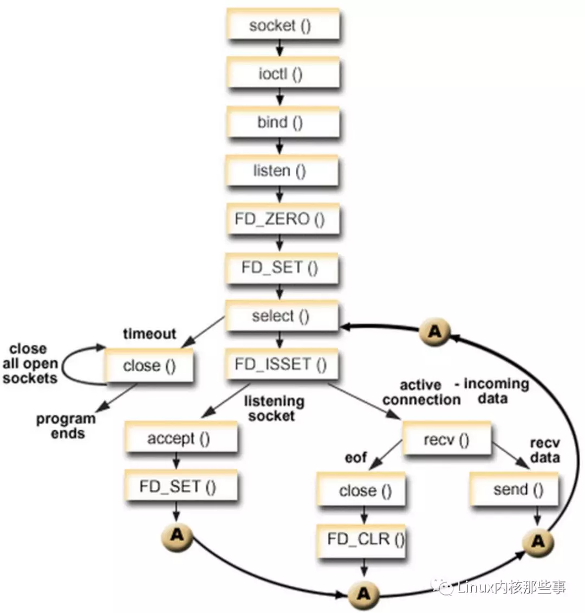

##   SELECT 内核实现

1. 使用copy_from_user从用户空间拷贝fd_set到内核空间
2. 注册回调函数__pollwait
3. 遍历所有fd，调用其对应的poll方法（对于socket，这个poll方法是sock_poll，sock_poll根据情况会调用到tcp_poll,udp_poll或者datagram_poll）
4. 以tcp_poll为例，其核心实现就是__pollwait，也就是上面注册的回调函数。
5. __pollwait的主要工作就是把current（当前进程）挂到设备的等待队列中，不同的设备有不同的等待队列，对于tcp_poll来说，其等待队列是sk->sk_sleep（注意把进程挂到等待队列中并不代表进程已经睡眠了）。在设备收到一条消息（网络设备）或填写完文件数据（磁盘设备）后，会唤醒设备等待队列上睡眠的进程，这时current便被唤醒了。
6. poll方法返回时会返回一个描述读写操作是否就绪的mask掩码，根据这个mask掩码给fd_set赋值。
7. 如果遍历完所有的fd，还没有返回一个可读写的mask掩码，则会调用schedule_timeout是调用select的进程（也就是current）进入睡眠。当设备驱动发生自身资源可读写后，会唤醒其等待队列上睡眠的进程。如果超过一定的超时时间（schedule_timeout指定），还是没人唤醒，则调用select的进程会重新被唤醒获得CPU，进而重新遍历fd，判断有没有就绪的fd。
8. 把fd_set从内核空间拷贝到用户空间。

    总结：

    select的几大缺点：

   （1）每次调用select，都需要把fd集合从用户态拷贝到内核态，这个开销在fd很多时会很大

   （2）同时每次调用select都需要在内核遍历传递进来的所有fd，这个开销在fd很多时也很大

   （3）select支持的文件描述符数量太小了，默认是1024

### select 的使用方式（图片来源于网络）：



### Linux-2.6.25 select系统调用源码分析

> https://www.iteye.com/blog/zhangyafeikimi-248815
**主要有4个函数:**

- sys_select：处理时间参数，调用core_sys_select。
- core_sys_select：处理三个fd_set参数，调用do_select。
- do_select：做select/poll的工作。在合适的时机把自己挂起等待，调用sock_poll。
- sock_poll：用函数指针分派到具体的协议层函数tcp_poll、udp_poll、datagram_poll。


```
select(...){
// 处理了超时值（如果有）
sys_select(...){
   // 为do_select准备好了位图,然后调用do_select,将返回的结果集,返回到用户空间 
   core_sys_select(...){
   // 真正的select在此,遍历了所有的fd,调用对应的xxx_poll函数 
     do_select(...){
       sock_poll(...){
       
...

```


```c
/* 
sys_select(fs/select.c) 
处理了超时值（如果有）,将struct timeval转换成了时钟周期数,调用core_sys_select,然后检查剩余时间,处理时间 
*/  
asmlinkage long sys_select(int n, fd_set __user *inp, fd_set __user *outp,  
                           fd_set __user *exp, struct timeval __user *tvp)  
{  
    s64 timeout = -1;  
    struct timeval tv;  
    int ret;  
  
    if (tvp) {/*如果有超时值*/  
        if (copy_from_user(&tv, tvp, sizeof(tv)))  
            return -EFAULT;  
  
        if (tv.tv_sec < 0 || tv.tv_usec < 0)/*时间无效*/  
            return -EINVAL;  
  
        /* Cast to u64 to make GCC stop complaining */  
        if ((u64)tv.tv_sec >= (u64)MAX_INT64_SECONDS)  
            timeout = -1;   /* 无限等待*/  
        else {  
            timeout = DIV_ROUND_UP(tv.tv_usec, USEC_PER_SEC/HZ);  
            timeout += tv.tv_sec * HZ;/*计算出超时的相对时间,单位为时钟周期数*/  
        }  
    }  
  
    /*主要工作都在core_sys_select中做了*/  
    ret = core_sys_select(n, inp, outp, exp, &timeout);  
  
    if (tvp) {/*如果有超时值*/  
        struct timeval rtv;  
  
        if (current->personality & STICKY_TIMEOUTS)/*模拟bug的一个机制,不详细描述*/  
            goto sticky;  
        /*rtv中是剩余的时间*/  
        rtv.tv_usec = jiffies_to_usecs(do_div((*(u64*)&timeout), HZ));  
        rtv.tv_sec = timeout;  
        if (timeval_compare(&rtv, &tv) >= 0)/*如果core_sys_select超时返回,更新时间*/  
            rtv = tv;  
        /*拷贝更新后的时间到用户空间*/  
        if (copy_to_user(tvp, &rtv, sizeof(rtv))) {  
sticky:  
            /* 
            * If an application puts its timeval in read-only 
            * memory, we don't want the Linux-specific update to 
            * the timeval to cause a fault after the select has 
            * completed successfully. However, because we're not 
            * updating the timeval, we can't restart the system 
            * call. 
            */  
            if (ret == -ERESTARTNOHAND)/*ERESTARTNOHAND表明,被中断的系统调用*/  
                ret = -EINTR;  
        }  
    }  
  
    return ret;  
}  
  
  
  
  
  
  
/*core_sys_select 
为do_select准备好了位图,然后调用do_select,将返回的结果集,返回到用户空间 
*/  
static int core_sys_select(int n, fd_set __user *inp, fd_set __user *outp,  
                           fd_set __user *exp, s64 *timeout)  
{  
    fd_set_bits fds;  
    void *bits;  
    int ret, max_fds;  
    unsigned int size;  
    struct fdtable *fdt;  
    /* Allocate small arguments on the stack to save memory and be faster */  
  
    /*SELECT_STACK_ALLOC 定义为256*/  
    long stack_fds[SELECT_STACK_ALLOC/sizeof(long)];  
  
    ret = -EINVAL;  
    if (n < 0)  
        goto out_nofds;  
  
    /* max_fds can increase, so grab it once to avoid race */  
    rcu_read_lock();  
    fdt = files_fdtable(current->files);/*获取当前进程的文件描述符表*/  
    max_fds = fdt->max_fds;  
    rcu_read_unlock();  
    if (n > max_fds)/*修正用户传入的第一个参数：fd_set中文件描述符的最大值*/  
        n = max_fds;  
  
    /* 
    * We need 6 bitmaps (in/out/ex for both incoming and outgoing), 
    * since we used fdset we need to allocate memory in units of 
    * long-words.  
    */  
  
    /* 
    如果stack_fds数组的大小不能容纳下所有的fd_set,就用kmalloc重新分配一个大数组。 
    然后将位图平均分成份,并初始化fds结构 
    */  
    size = FDS_BYTES(n);  
    bits = stack_fds;  
    if (size > sizeof(stack_fds) / 6) {  
        /* Not enough space in on-stack array; must use kmalloc */  
        ret = -ENOMEM;  
        bits = kmalloc(6 * size, GFP_KERNEL);  
        if (!bits)  
            goto out_nofds;  
    }  
    fds.in      = bits;  
    fds.out     = bits +   size;  
    fds.ex      = bits + 2*size;  
    fds.res_in  = bits + 3*size;  
    fds.res_out = bits + 4*size;  
    fds.res_ex  = bits + 5*size;  
  
    /*get_fd_set仅仅调用copy_from_user从用户空间拷贝了fd_set*/  
    if ((ret = get_fd_set(n, inp, fds.in)) ||  
        (ret = get_fd_set(n, outp, fds.out)) ||  
        (ret = get_fd_set(n, exp, fds.ex)))  
        goto out;  
  
    zero_fd_set(n, fds.res_in);  
    zero_fd_set(n, fds.res_out);  
    zero_fd_set(n, fds.res_ex);  
  
  
    /* 
    接力棒传给了do_select 
    */  
    ret = do_select(n, &fds, timeout);  
  
    if (ret < 0)  
        goto out;  
  
    /*do_select返回,是一种异常状态*/  
    if (!ret) {  
        /*记得上面的sys_select不？将ERESTARTNOHAND转换成了EINTR并返回。EINTR表明系统调用被中断*/  
        ret = -ERESTARTNOHAND;  
        if (signal_pending(current))/*当当前进程有信号要处理时,signal_pending返回真,这符合了EINTR的语义*/  
            goto out;  
        ret = 0;  
    }  
  
    /*把结果集,拷贝回用户空间*/  
    if (set_fd_set(n, inp, fds.res_in) ||  
        set_fd_set(n, outp, fds.res_out) ||  
        set_fd_set(n, exp, fds.res_ex))  
        ret = -EFAULT;  
  
out:  
    if (bits != stack_fds)  
        kfree(bits);/*对应上面的kmalloc*/  
out_nofds:  
    return ret;  
}  
  
  
  
  
  
  
  
  
/*do_select 
真正的select在此,遍历了所有的fd,调用对应的xxx_poll函数 
*/  
int do_select(int n, fd_set_bits *fds, s64 *timeout)  
{  
    struct poll_wqueues table;  
    poll_table *wait;  
    int retval, i;  
  
    rcu_read_lock();  
    /*根据已经打开fd的位图检查用户打开的fd, 要求对应fd必须打开, 并且返回最大的fd*/  
    retval = max_select_fd(n, fds);  
    rcu_read_unlock();  
  
    if (retval < 0)  
        return retval;  
    n = retval;  
  
  
    /*将当前进程放入自已的等待队列table, 并将该等待队列加入到该测试表wait*/  
    poll_initwait(&table);  
    wait = &table.pt;  
  
    if (!*timeout)  
        wait = NULL;  
    retval = 0;  
  
    for (;;) {/*死循环*/  
        unsigned long *rinp, *routp, *rexp, *inp, *outp, *exp;  
        long __timeout;  
  
        /*注意:可中断的睡眠状态*/  
        set_current_state(TASK_INTERRUPTIBLE);  
  
        inp = fds->in; outp = fds->out; exp = fds->ex;  
        rinp = fds->res_in; routp = fds->res_out; rexp = fds->res_ex;  
  
  
        for (i = 0; i < n; ++rinp, ++routp, ++rexp) {/*遍历所有fd*/  
            unsigned long in, out, ex, all_bits, bit = 1, mask, j;  
            unsigned long res_in = 0, res_out = 0, res_ex = 0;  
            const struct file_operations *f_op = NULL;  
            struct file *file = NULL;  
  
            in = *inp++; out = *outp++; ex = *exp++;  
            all_bits = in | out | ex;  
            if (all_bits == 0) {  
                /* 
                __NFDBITS定义为(8 * sizeof(unsigned long)),即long的位数。 
                因为一个long代表了__NFDBITS位，所以跳到下一个位图i要增加__NFDBITS 
                */  
                i += __NFDBITS;  
                continue;  
            }  
  
            for (j = 0; j < __NFDBITS; ++j, ++i, bit <<= 1) {  
                int fput_needed;  
                if (i >= n)  
                    break;  
  
                /*测试每一位*/  
                if (!(bit & all_bits))  
                    continue;  
  
                /*得到file结构指针，并增加引用计数字段f_count*/  
                file = fget_light(i, &fput_needed);  
                if (file) {  
                    f_op = file->f_op;  
                    mask = DEFAULT_POLLMASK;  
  
                    /*对于socket描述符,f_op->poll对应的函数是sock_poll 
                    注意第三个参数是等待队列，在poll成功后会将本进程唤醒执行*/  
                    if (f_op && f_op->poll)  
                        mask = (*f_op->poll)(file, retval ? NULL : wait);  
  
                    /*释放file结构指针，实际就是减小他的一个引用计数字段f_count*/  
                    fput_light(file, fput_needed);  
  
                    /*根据poll的结果设置状态,要返回select出来的fd数目，所以retval++。 
                    注意：retval是in out ex三个集合的总和*/  
                    if ((mask & POLLIN_SET) && (in & bit)) {  
                        res_in |= bit;  
                        retval++;  
                    }  
                    if ((mask & POLLOUT_SET) && (out & bit)) {  
                        res_out |= bit;  
                        retval++;  
                    }  
                    if ((mask & POLLEX_SET) && (ex & bit)) {  
                        res_ex |= bit;  
                        retval++;  
                    }  
                }  
  
                /* 
                注意前面的set_current_state(TASK_INTERRUPTIBLE); 
                因为已经进入TASK_INTERRUPTIBLE状态,所以cond_resched回调度其他进程来运行， 
                这里的目的纯粹是为了增加一个抢占点。被抢占后，由等待队列机制唤醒。 
 
                在支持抢占式调度的内核中（定义了CONFIG_PREEMPT），cond_resched是空操作 
                */   
                cond_resched();  
            }  
            /*根据poll的结果写回到输出位图里*/  
            if (res_in)  
                *rinp = res_in;  
            if (res_out)  
                *routp = res_out;  
            if (res_ex)  
                *rexp = res_ex;  
        }  
        wait = NULL;  
        if (retval || !*timeout || signal_pending(current))/*signal_pending前面说过了*/  
            break;  
        if(table.error) {  
            retval = table.error;  
            break;  
        }  
  
        if (*timeout < 0) {  
            /*无限等待*/  
            __timeout = MAX_SCHEDULE_TIMEOUT;  
        } else if (unlikely(*timeout >= (s64)MAX_SCHEDULE_TIMEOUT - 1)) {  
            /* 时间超过MAX_SCHEDULE_TIMEOUT,即schedule_timeout允许的最大值，用一个循环来不断减少超时值*/  
            __timeout = MAX_SCHEDULE_TIMEOUT - 1;  
            *timeout -= __timeout;  
        } else {  
            /*等待一段时间*/  
            __timeout = *timeout;  
            *timeout = 0;  
        }  
  
        /*TASK_INTERRUPTIBLE状态下，调用schedule_timeout的进程会在收到信号后重新得到调度的机会， 
        即schedule_timeout返回,并返回剩余的时钟周期数 
        */  
        __timeout = schedule_timeout(__timeout);  
        if (*timeout >= 0)  
            *timeout += __timeout;  
    }  
  
    /*设置为运行状态*/  
    __set_current_state(TASK_RUNNING);  
    /*清理等待队列*/  
    poll_freewait(&table);  
  
    return retval;  
}  
  
  
static unsigned int sock_poll(struct file *file, poll_table *wait)  
{  
    struct socket *sock;  
  
    /*约定socket的file->private_data字段放着对应的socket结构指针*/  
    sock = file->private_data;  
  
    /*对应了三个协议的函数tcp_poll,udp_poll,datagram_poll，其中udp_poll几乎直接调用了datagram_poll 
    累了，先休息一下，这三个函数以后分析*/  
    return sock->ops->poll(file, sock, wait);  
}  
```

