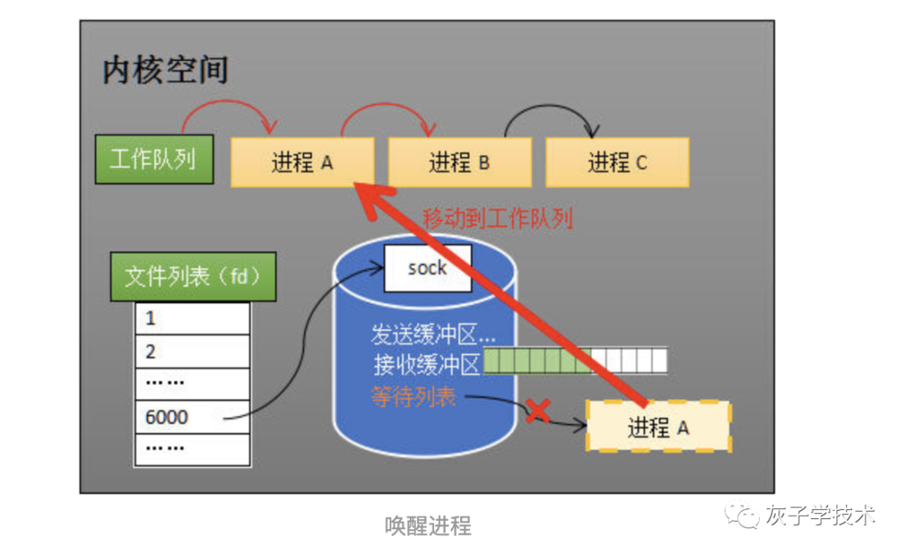

https://blog.csdn.net/zhghost/article/details/109019955

本篇是多路复用相关的知识的第二篇文章，主要讲解中断和进程阻塞在整个网络数据传递过程中，所经历的过程。

一、中断

一般而言，由硬件产生的信号需要cpu立马做出回应（不然数据可能就丢失），所以它的优先级很高。cpu理应中断掉正在执行的程序，去做出响应；当cpu完成对硬件的响应后，再重新执行用户程序。

中断的过程如下图，和函数调用差不多。只不过函数调用是事先定好位置，而中断的位置由“信号”决定。

对于网络数据而言，网卡接收到的数据，会把数据写入到内存中。然后，网卡向cpu发出一个中断信号，操作系统便能得知有新数据到来，再通过网卡中断程序去处理数据。

二、进程阻塞

阻塞是进程调度的关键一环，指的是进程在等待某事件（如接收到网络数据）发生之前的等待状态，recv、select和epoll都是阻塞方法。

对于阻塞来说，是不占用CPU资源的。下面我们看下“进程阻塞为什么不占用cpu资源？”

操作系统为了支持多任务，实现了进程调度的功能，会把进程分为“运行”和“等待”等几种状态。

1.运行状态是进程获得cpu使用权，正在执行代码的状态；
2.等待状态是阻塞状态，比如上述程序运行到recv时，
程序会从运行状态变为等待状态，接收到数据后又变回运行状态。
操作系统会分时执行各个运行状态的进程，由于速度很快，看上去就像是同时执行多个任务。下面演示了这个运行和阻塞的调度情况。

第一步：当进程A执行到创建socket的语句时，操作系统会创建一个由文件系统管理的socket对象（如下图）。这个socket对象包含了发送缓冲区、接收缓冲区、等待队列等成员。

等待队列是个非常重要的结构，它指向所有需要等待该socket事件的进程。

第二步：当程序执行到recv时，操作系统会将进程A从工作队列移动到该socket的等待队列中（如下图）。

由于工作队列只剩下了进程B和C，依据进程调度，cpu会轮流执行这两个进程的程序，不会执行进程A的程序。

所以进程A被阻塞，不会往下执行代码，也不会占用cpu资源。

备注：操作系统添加等待队列只是添加了对这个“等待中”进程的引用，以便在接收到数据时获取进程对象、将其唤醒，而非直接将进程管理纳入自己之下。

第三步：内核接收数据

进程在recv阻塞期间，计算机收到了对端传送的数据（步骤①）。数据经由网卡传送到内存（步骤②），然后网卡通过中断信号通知cpu有数据到达，cpu执行中断程序（步骤③）。此处的中断程序主要有两项功能，先将网络数据写入到对应socket的接收缓冲区里面（步骤④），再唤醒进程A（步骤⑤），重新将进程A放入工作队列中。

第四步：唤醒进程

当socket接收到数据后，操作系统将该socket等待队列上的进程重新放回到工作队列，该进程变成运行状态，继续执行代码。也由于socket的接收缓冲区已经有了数据，recv可以返回接收到的数据。

